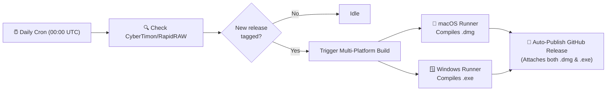

# RapidRAW with Export Image Borders 🖼️

[](https://www.gnu.org/licenses/agpl-3.0)
[]()
[]()
[](https://github.com/puneetrane1811/rapidraw-export-borders/actions/workflows/auto-release.yml)

A custom feature extension and automated CI/CD distribution pipeline for **[RapidRAW](https://github.com/CyberTimon/RapidRAW)**—the modern, high-performance open-source RAW photo editor built with Tauri, Rust, and React.

This project introduces a native **Export Image Borders** feature directly into RapidRAW's UI and export pipeline, eliminating the need for external scripts or post-processing tools like ImageMagick.

---

## Table of Contents

- [Motivation](#-motivation)
- [Features](#-features)
- [Downloads & Installation](#-downloads--installation)
  - [macOS (.dmg)](#macos-dmg)
  - [Windows (.exe)](#windows-exe)
- [How It Works (Code Architecture)](#-how-it-works-code-architecture)
- [Included Files](#-included-files)
- [Continuous Cloud Automation (CI/CD)](#-continuous-cloud-automation-cicd)
  - [Auto Rebuild on Upstream Releases](#1-auto-rebuild-on-upstream-releases)
  - [On-Demand Windows Builder](#2-on-demand-windows-builder)
- [Local Development & Building](#-local-development--building)
  - [Automated Local Script](#option-a-automated-local-rebuild)
  - [Manual Git Patch Workflow](#option-b-manual-git-patch-workflow)
- [Future Upstream Maintenance & Conflicts](#-future-upstream-maintenance--conflicts)
- [License & Acknowledgments](#-license--acknowledgments)

---

## 💡 Motivation

Photographers often add borders to photos for social media presentation (e.g., maintaining consistent aspect ratios on Instagram without cropping), white margins for prints, or aesthetic framing.

Previously, achieving this required exporting images from RapidRAW and running terminal scripts with ImageMagick:
```bash
# Prior workaround:
for file in *.jpg; do 
  magick "$file" -border 1%x1% "border_${file}"
done
```

This project integrates that capability natively into RapidRAW so borders can be applied seamlessly during single-image or batch exports.

---

## ✨ Features

- **Toggle Switch**: Enable or disable borders on export with one click (`Add Border`).
- **Configurable Thickness**: Fine-tune border size using a smooth slider from `0.1%` up to `20.0%` of image dimensions (default: `1.0%`).
- **Color Picker**: Integrated native RGB color picker to select any hex color (default: `#ffffff` pure white).
- **Preset Persistence**: Border configurations are automatically remembered in default presets (`High Quality`, `Fast Web`) and custom user presets.
- **Pipeline Integration**: Fully compatible with resizing, watermarking, GPS stripping, and metadata retention.
- **Batch Export Support**: Applies borders consistently across bulk photo exports.

---

## 📦 Downloads & Installation

Pre-compiled, ready-to-install packages are available on the **[Releases](https://github.com/puneetrane1811/rapidraw-export-borders/releases)** page. **No programming tools or developer environments are needed.**

### macOS (.dmg)

1. Download `RapidRAW_<version>_aarch64.dmg` from [Releases](https://github.com/puneetrane1811/rapidraw-export-borders/releases).
2. Double-click the `.dmg` file and drag **RapidRAW** into your `/Applications` folder.
3. **First-launch Gatekeeper Bypass** (required for unsigned local builds):
   - **Finder**: Right-click (or <kbd>Control</kbd>-click) `RapidRAW.app` in `/Applications`, select **Open**, and click **Open** on the confirmation dialog.
   - **Or via Terminal**:
     ```bash
     xattr -cr /Applications/RapidRAW.app
     ```

### Windows (.exe)

1. Download `RapidRAW_<version>_x64-setup.exe` from [Releases](https://github.com/puneetrane1811/rapidraw-export-borders/releases) or the [Actions Artifacts](https://github.com/puneetrane1811/rapidraw-export-borders/actions).
2. Run the setup installer and follow the on-screen instructions.

---

## 🧠 How It Works (Code Architecture)

The feature is cleanly separated across the Rust backend and React frontend:

```
RapidRAW Source Tree
├── src-tauri/
│   ├── src/
│   │   ├── export_processing.rs   <-- Border math, hex parsing & canvas overlay
│   │   └── app_settings.rs        <-- Preset schema & default preset values
├── src/
│   ├── components/
│   │   ├── panel/right/
│   │   │   └── ExportPanel.tsx    <-- Switch, slider & color picker UI
│   │   └── ui/
│   │       └── ExportImportProperties.tsx <-- TypeScript interface definitions
│   ├── hooks/
│   │   ├── useExportSettings.ts   <-- State management & preset synchronization
│   │   └── useExternalEditSession.ts <-- External session payload defaults
│   └── i18n/locales/
│       └── en.json                <-- English UI localization keys
```

### Technical Details

1. **Dimension Math (`export_processing.rs`)**:
   Calculates border padding as a percentage of the respective image dimensions with checked arithmetic:
   $$\text{horizontal} = \max\left(1, \operatorname{round}\left(\text{width} \times \frac{\text{size}}{100}\right)\right)$$
   $$\text{vertical} = \max\left(1, \operatorname{round}\left(\text{height} \times \frac{\text{size}}{100}\right)\right)$$
2. **Buffer Allocation & Blending**:
   Allocates a new RGBA canvas sized $(\text{width} + 2 \times \text{horizontal}, \text{height} + 2 \times \text{vertical})$ initialized to the chosen hex color, and overlays the processed image into the center.
3. **Resolution Metadata Preservation**:
   Updates `final_full_w` and `final_full_h` in `determine_export_dimensions` so exported sidecars and EXIF records match the final bordered canvas size.

---

## 📂 Included Files

| File | Description |
| :--- | :--- |
| [`export-borders.patch`](./export-borders.patch) | Complete, clean unified diff patch against the RapidRAW codebase. |
| [`update-and-build.sh`](./update-and-build.sh) | Local shell script to download any RapidRAW version, apply the patch, and build a `.dmg`. |
| [`.github/workflows/auto-release.yml`](./.github/workflows/auto-release.yml) | Continuous cloud automation: monitors upstream, builds macOS and Windows, and publishes releases. |
| [`.github/workflows/build-windows.yml`](./.github/workflows/build-windows.yml) | Dedicated workflow to compile native Windows `.exe` installers on demand. |

---

## 🚀 Continuous Cloud Automation (CI/CD)

This repository includes fully automated GitHub Actions workflows that run in the cloud on Microsoft and Apple runners.

### 1. Auto Rebuild on Upstream Releases



- **Schedule**: Automatically polls [CyberTimon/RapidRAW](https://github.com/CyberTimon/RapidRAW) daily at `00:00 UTC`.
- **Parallel Compilation**: When a new tag is detected, it spins up parallel `macos-latest` and `windows-latest` runners.
- **Auto-Publish**: Automatically compiles the `.dmg` and `.exe` and attaches them to a new release tag (e.g., `v1.7.0-borders`).
- **Manual Trigger**: Can also be run on demand from **Actions** > **Auto Rebuild on Upstream Release** > **Run workflow**.

### 2. On-Demand Windows Builder

- File: [`.github/workflows/build-windows.yml`](./.github/workflows/build-windows.yml)
- Can be triggered manually at any time to compile a Windows `.exe` against any specified branch or tag.

---

## 💻 Local Development & Building

If you prefer building locally on your Mac:

### Option A: Automated Local Rebuild

Use the included helper script:
```bash
# Build against latest main branch:
./update-and-build.sh

# Build against a specific tag (e.g. v1.7.0):
./update-and-build.sh v1.7.0
```

### Option B: Manual Git Patch Workflow

1. **Clone RapidRAW**:
   ```bash
   git clone https://github.com/CyberTimon/RapidRAW.git
   cd RapidRAW
   ```

2. **Apply the patch**:
   ```bash
   git apply --ignore-whitespace /path/to/export-borders.patch
   ```

3. **Build the macOS DMG**:
   ```bash
   npm ci
   npm run tauri -- build --bundles dmg --no-sign
   ```

4. **Build the Windows EXE (on a Windows PC)**:
   ```bash
   npm ci
   npm run tauri -- build --bundles nsis
   ```

---

## ⚠️ Future Upstream Maintenance & Conflicts

Because this patch is small and modular (isolated strictly to export UI, preset storage, and export processing), it applies cleanly across versions.

If RapidRAW significantly refactors the export panel in a future release:
1. Run:
   ```bash
   git apply --reject export-borders.patch
   ```
2. Any conflicting hunks will be written to `.rej` files.
3. Review the `.rej` file and manually reposition the small UI block in `ExportPanel.tsx` or hook in `export_processing.rs`.

---

## 📄 License & Acknowledgments

- **RapidRAW** is created by [Timon Käch (CyberTimon)](https://github.com/CyberTimon) and licensed under the **[GNU Affero General Public License v3 (AGPL-3.0)](https://www.gnu.org/licenses/agpl-3.0)**.
- This patch and all workflows in this repository are distributed under the same **AGPL-3.0** license.
