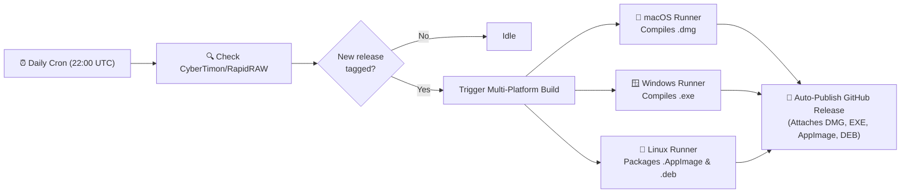

# RapidRAW: Advanced Borders & Grids 🖼️📐

[](https://www.gnu.org/licenses/agpl-3.0)
[]()
[]()
[]()
[](https://github.com/puneetrane1811/rapidraw-creative-export-borders-and-grids/actions/workflows/auto-release.yml)

A custom feature extension and automated CI/CD distribution pipeline for **[RapidRAW](https://github.com/CyberTimon/RapidRAW)**—the modern, high-performance open-source RAW photo editor built with Tauri, Rust, and React.

This project introduces native **Borders, Fine-Art Keylines, Multi-Photo Collages, Tile Splitters, and Real-Time Live Preview** directly into RapidRAW's UI and export pipeline, eliminating the need for external tools or fragmented post-processing scripts.

---

## Table of Contents

- [Motivation](#-motivation)
- [Features](#-features)
- [Downloads & Installation](#-downloads--installation)
  - [macOS (.dmg)](#macos-dmg)
  - [Windows (.exe)](#windows-exe)
  - [Linux (.AppImage / .deb)](#linux-appimage--deb)
- [How It Works (Code Architecture)](#-how-it-works-code-architecture)
- [Included Files](#-included-files)
- [Continuous Cloud Automation (CI/CD)](#-continuous-cloud-automation-cicd)
  - [Auto Rebuild on Upstream Releases](#1-auto-rebuild-on-upstream-releases)
  - [On-Demand macOS Builder](#2-on-demand-macos-builder)
  - [On-Demand Windows Builder](#3-on-demand-windows-builder)
  - [On-Demand Linux Builder](#4-on-demand-linux-builder)
- [Local Development & Building](#-local-development--building)
  - [Automated Local Script](#option-a-automated-local-rebuild)
  - [Manual Git Patch Workflow](#option-b-manual-git-patch-workflow)
- [Future Upstream Maintenance & Conflicts](#-future-upstream-maintenance--conflicts)
- [License & Acknowledgments](#-license--acknowledgments)

---

## 💡 Motivation

Modern photo publishing requires far more than basic raw development. Photographers regularly prepare images for diverse finishing formats:
- **Social Media & Portfolios**: Maintaining uniform aspect ratios without awkward cropping on platforms like Instagram, Behance, or VSCO.
- **Swipeable Panoramas & Mosaics**: Slicing wide landscapes or editorial shots into seamless multi-image carousels and $3 \times 3$ grid profile mosaics.
- **Client Contact Sheets & Collages**: Grouping series of photos into clean, structured $N \times M$ grids with precise gutters for client proofing or moodboards.
- **Museum & Gallery Prints**: Framing fine-art prints with outer mats and delicate, contrasting inner keylines (fillets) to separate the artwork from the mat.

### The Problem: Fragmented Workflows & Blind Processing
Previously, achieving these results required exporting files from RapidRAW and jumping between multiple external tools—Photoshop, Lightroom's Print module, mobile apps (Unfold, PanoraSplit), or tedious terminal scripts:

```bash
# Prior fragmented workarounds:
# 1. Adding borders
magick input.jpg -bordercolor white -border 2% framed.jpg

# 2. Assembling a 2x2 contact sheet collage
montage photo1.jpg photo2.jpg photo3.jpg photo4.jpg -tile 2x2 -geometry +20+20 collage.jpg

# 3. Slicing a panoramic swipe carousel
magick panorama.jpg -crop 3x1@ +repage tile_%d.jpg
```

This multi-step workflow created major pain points:
1. **Blind Trial-and-Error**: Shell scripts and external utilities provide no visual feedback until processing is done. Adjusting a margin or gutter required re-exporting and re-running commands repeatedly.
2. **Re-compression Quality Loss**: Exporting intermediate JPEGs and re-saving them through secondary tools causes unnecessary generation loss and degrades image fidelity.
3. **Broken Flow**: Photographers had to manage different third-party apps for borders, other apps for collage montages, and yet other tools for Instagram tile slicing.

### The Solution: Native Creative Export in RapidRAW
This extension integrates borders, fine-art keylines, multi-photo collages, multi-tile splitting, and composition grids directly into RapidRAW's core export engine:
- **Zero Generation Loss**: Borders, gutters, and slice matrices are rendered in a single high-performance pipeline directly from the developed 16-bit raster data.
- **Real-Time Visual Proofing**: An embedded, sticky HTML5 canvas renders live visual updates at 60fps as you adjust sliders, colors, and layouts.
- **One-Click Repeatability**: All configurations are remembered across export presets (`High Quality`, `Fast Web`, and custom presets).

---

## ✨ Features

- **🖼️ Real-Time Live Export Preview**: Interactive canvas embedded directly in the Export Panel providing instant visual feedback for borders, keylines, collage layouts, and tile slice lines as you adjust sliders, plus a pop-out high-resolution inspection modal.
- **📐 Multi-Photo Contact Sheet / Grid Collage**: Combine multiple selected photos into an $N \times M$ grid collage on a single canvas with customizable cell gutters (spacing) and outer border framing.
- **🔲 Fit vs. Fill Sizing Modes**: Choose between **Fit (Letterbox)** to preserve exact original photo aspect ratios without cropping, or **Fill (Center-Crop)** to fill each cell completely.
- **📱 Multi-Tile Grid Splitter (Instagram / Panorama)**: Slice any photo or collage into an $N \times M$ matrix of individual exported files with optional borders per tile—ideal for seamless swipeable Instagram carousels and $3 \times 3$ grid mosaics.
- **🎨 Fine-Art Inset Keyline**: Add museum-grade framing with a contrasting hairline inner border inset at any distance inside the outer mat.
- **📏 Composition Grid Overlay**: Overlay Rule of Thirds ($3 \times 3$) or custom $N \times M$ grid lines with adjustable opacity, thickness, and color for proofing and composition review.
- **⚡ Fully Combinable**: Use any feature individually or combine them all together seamlessly in a single export run.
- **💾 Preset Persistence**: All border, keyline, collage, and tile split configurations are automatically remembered in default presets and custom user presets.

---

## 📦 Downloads & Installation

Pre-compiled, ready-to-install packages are available on the **[Releases](https://github.com/puneetrane1811/rapidraw-creative-export-borders-and-grids/releases)** page. **No programming tools or developer environments are needed.**

### macOS (.dmg)

1. Download `RapidRAW_<version>_aarch64.dmg` from [Releases](https://github.com/puneetrane1811/rapidraw-creative-export-borders-and-grids/releases).
2. Double-click the `.dmg` file and drag **RapidRAW** into your `/Applications` folder.
3. **First-launch Gatekeeper Bypass** (required for unsigned local builds):
   - **Finder**: Right-click (or <kbd>Control</kbd>-click) `RapidRAW.app` in `/Applications`, select **Open**, and click **Open** on the confirmation dialog.
   - **Or via Terminal**:
     ```bash
     xattr -cr /Applications/RapidRAW.app
     ```

### Windows (.exe)

1. Download `RapidRAW_<version>_x64-setup.exe` from [Releases](https://github.com/puneetrane1811/rapidraw-creative-export-borders-and-grids/releases) or the [Actions Artifacts](https://github.com/puneetrane1811/rapidraw-creative-export-borders-and-grids/actions).
2. Run the setup installer and follow the on-screen instructions.

### Linux (.AppImage & .deb)

Packages are available from [Releases](https://github.com/puneetrane1811/rapidraw-creative-export-borders-and-grids/releases):

- **Universal AppImage** (runs on Ubuntu, Fedora, Arch, Debian, openSUSE, etc.):
  ```bash
  chmod +x RapidRAW_*.AppImage
  ./RapidRAW_*.AppImage
  ```
- **Debian / Ubuntu Package (`.deb`)**:
  ```bash
  sudo dpkg -i RapidRAW_*.deb
  sudo apt-get install -f   # Resolves any missing system dependencies
  ```

---

## 🧠 How It Works (Code Architecture)

The feature is cleanly separated across the Rust backend and React frontend:

```
RapidRAW Source Tree
├── src-tauri/
│   ├── src/
│   │   ├── export_processing.rs   <-- Border math, keylines, collages & tile slicing
│   │   └── app_settings.rs        <-- Preset schema & default preset values
├── src/
│   ├── components/
│   │   ├── panel/right/
│   │   │   ├── ExportLivePreview.tsx <-- Real-time HTML5 preview canvas & inspector
│   │   │   └── ExportPanel.tsx    <-- Borders, keylines, collages & tile split UI
│   │   └── ui/
│   │       └── ExportImportProperties.tsx <-- TypeScript interface definitions
│   ├── hooks/
│   │   ├── useExportSettings.ts   <-- State management & preset synchronization
│   │   └── useExternalEditSession.ts <-- External session payload defaults
│   └── i18n/locales/
│       └── en.json                <-- Localization strings
```

### Technical Details

1. **Dimension Math (`export_processing.rs`)**:
   Calculates border padding as a percentage of the image dimensions with integer overflow safety:
   ```rust
   let horizontal = ((width as f32 * size / 100.0).round() as u32).max(1);
   let vertical   = ((height as f32 * size / 100.0).round() as u32).max(1);

   let output_width  = width.checked_add(horizontal.saturating_mul(2))?;
   let output_height = height.checked_add(vertical.saturating_mul(2))?;
   ```
2. **Buffer Allocation & Blending**:
   Allocates a new RGBA canvas sized `(output_width, output_height)` initialized to the chosen hex color, and overlays the processed image onto the center at `(horizontal, vertical)`.
3. **Resolution Metadata Preservation**:
   Updates `final_full_w` and `final_full_h` in `determine_export_dimensions` so exported sidecars and EXIF records match the final bordered canvas size.

---

## 📂 Included Files

| File | Description |
| :--- | :--- |
| [`creative-export-borders-and-grids.patch`](./creative-export-borders-and-grids.patch) | Complete, clean unified diff patch against the RapidRAW codebase. |
| [`build-creative-export-borders-and-grids.sh`](./build-creative-export-borders-and-grids.sh) | Local shell script to download any RapidRAW version, apply the patch, and build a `.dmg`. |
| [`.github/workflows/auto-release.yml`](./.github/workflows/auto-release.yml) | Continuous cloud automation: monitors upstream, builds macOS, Windows, & Linux, and publishes releases. |
| [`.github/workflows/build-macos.yml`](./.github/workflows/build-macos.yml) | Dedicated workflow to compile native macOS `.dmg` installers on demand. |
| [`.github/workflows/build-windows.yml`](./.github/workflows/build-windows.yml) | Dedicated workflow to compile native Windows `.exe` installers on demand. |
| [`.github/workflows/build-linux.yml`](./.github/workflows/build-linux.yml) | Dedicated workflow to package Linux `.AppImage` and `.deb` installers on demand. |

---

## 🚀 Continuous Cloud Automation (CI/CD)

This repository includes fully automated GitHub Actions workflows that run in the cloud on Microsoft, Apple, and Ubuntu runners.

### 1. Auto Rebuild on Upstream Releases



- **Schedule**: Automatically polls [CyberTimon/RapidRAW](https://github.com/CyberTimon/RapidRAW) daily at `22:00 UTC`.
- **Parallel Compilation**: When a new tag is detected, it spins up parallel `macos-latest`, `windows-latest`, and `ubuntu-24.04` runners.
- **Auto-Publish**: Automatically compiles and attaches all packages (`.dmg`, `.exe`, `.AppImage`, `.deb`) to a new release tag (e.g., `v1.7.0-borders`).
- **Manual Trigger**: Can also be run on demand from **Actions** > **Auto Rebuild on Upstream Release** > **Run workflow**.

#### 📊 Upstream Cadence & Timing Intelligence

Rather than checking at an arbitrary midnight hour, the `22:00 UTC` schedule is derived from statistical analysis of all 65 official RapidRAW releases:

1. **Bi-Weekly Cycle**: Mature releases (`v1.4.0` through `v1.6.3`) follow an extraordinarily consistent **11 to 14 day cadence**.
2. **Weekend Concentration**: Nearly **50%** of all releases drop on weekends (**Sunday alone represents 32.3%** of all releases):
   | Day of Week | Share of Releases |
   | :--- | :---: |
   | **Sunday** | **32.3%** (21 releases) |
   | **Saturday** | **16.9%** (11 releases) |
   | **Thursday / Friday** | **23.1%** (15 releases) |
   | **Mon / Tue / Wed** | **27.7%** (18 releases) |
3. **Evening Release Window**: The maintainer (based in Central Europe, UTC+1 / UTC+2) publishes predominantly between **17:00 and 21:00 UTC** (peak at 20:00 UTC).
4. **Why `22:00 UTC`**: Running at 22:00 UTC (midnight Central European Time) catches newly published releases within 1–2 hours of release without unnecessary midday poll checks.


### 2. On-Demand macOS Builder

- File: [`.github/workflows/build-macos.yml`](./.github/workflows/build-macos.yml)
- Runs on Apple Silicon (`macos-latest` M-series runners).
- Can be triggered manually at any time to compile a native macOS `.dmg` installer against any specified branch or tag.

### 3. On-Demand Windows Builder

- File: [`.github/workflows/build-windows.yml`](./.github/workflows/build-windows.yml)
- Can be triggered manually at any time to compile a Windows `.exe` setup installer against any specified branch or tag.

### 4. On-Demand Linux Builder

- File: [`.github/workflows/build-linux.yml`](./.github/workflows/build-linux.yml)
- Runs on Ubuntu 24.04 with WebKitGTK and AppIndicator system libraries.
- Compiles and publishes both **`.AppImage`** (portable binary) and **`.deb`** (Debian/Ubuntu) packages.


---

## 💻 Local Development & Building

If you prefer building locally on your Mac:

### Option A: Automated Local Rebuild

Use the included helper script:
```bash
# Build against latest main branch:
./build-creative-export-borders-and-grids.sh

# Build against a specific tag (e.g. v1.7.0):
./build-creative-export-borders-and-grids.sh v1.7.0
```

### Option B: Manual Git Patch Workflow

1. **Clone RapidRAW**:
   ```bash
   git clone https://github.com/CyberTimon/RapidRAW.git
   cd RapidRAW
   ```

2. **Apply the patch**:
   ```bash
   git apply --ignore-whitespace /path/to/creative-export-borders-and-grids.patch
   ```

3. **Build the macOS DMG**:
   ```bash
   npm ci
   npm run tauri -- build --bundles dmg --no-sign
   ```

4. **Build the Windows EXE (on a Windows PC)**:
   ```bash
   npm ci
   npm run tauri -- build --bundles nsis
   ```

---

## ⚠️ Future Upstream Maintenance & Conflicts

Because this patch is small and modular (isolated strictly to export UI, preset storage, and export processing), it applies cleanly across versions.

If RapidRAW significantly refactors the export panel in a future release:
1. Run:
   ```bash
   git apply --reject creative-export-borders-and-grids.patch
   ```
2. Any conflicting hunks will be written to `.rej` files.
3. Review the `.rej` file and manually reposition the small UI block in `ExportPanel.tsx` or hook in `export_processing.rs`.

---

## 📄 License & Acknowledgments

- **RapidRAW** is created by [Timon Käch (CyberTimon)](https://github.com/CyberTimon) and licensed under the **[GNU Affero General Public License v3 (AGPL-3.0)](https://www.gnu.org/licenses/agpl-3.0)**.
- This patch and all workflows in this repository are distributed under the same **AGPL-3.0** license.
