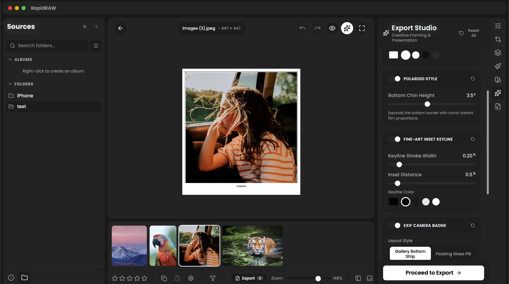
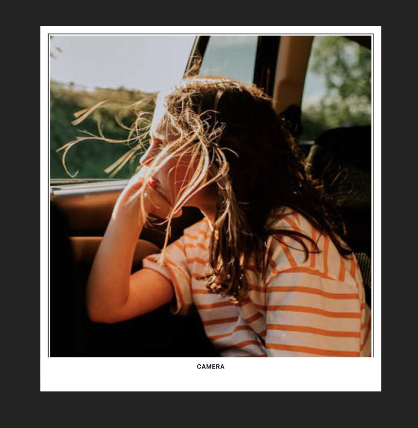
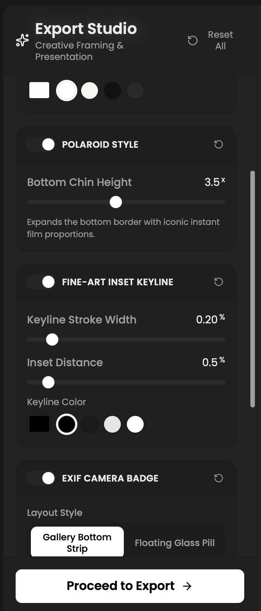
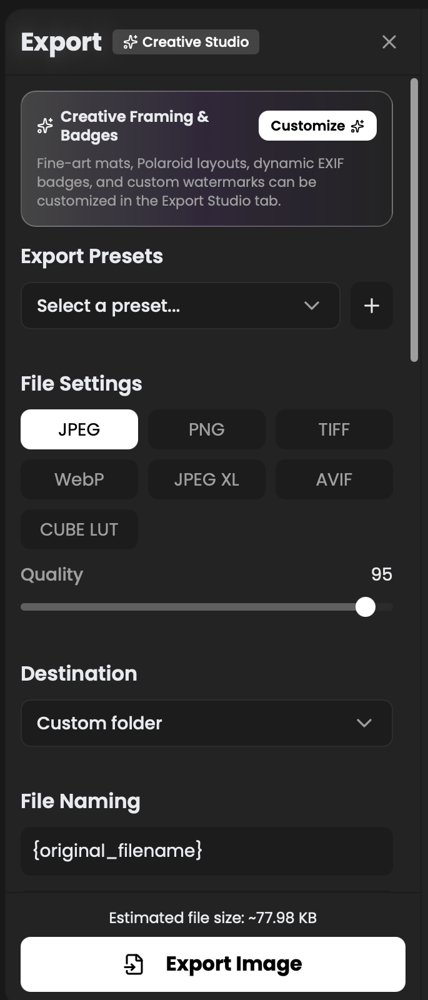

<div align="center">

# RapidRAW: Creative Export Studio ✨🖼️

**The high-performance RAW photo darkroom with fine-art finishing, dynamic EXIF badges, and museum-grade framing.**

[](https://www.gnu.org/licenses/agpl-3.0)
[]()
[]()
[]()
[](https://github.com/puneetrane1811/rapidraw-creative-export-borders-and-grids/releases)

---

### *RAW development is only half the photograph. Creative Export finishes the print.*

<br/>



*Live canvas proofing of a fine-art Polaroid mat, museum inset keyline, and EXIF badge directly inside the RapidRAW editor.*

</div>

Most RAW editors stop at pixel adjustments, leaving photographers to wrestle with Photoshop, Lightroom Print, or command-line scripts just to add exhibition mats, camera badges, or Instagram slice carousels.

**Creative Export Studio v2** transforms **[RapidRAW](https://github.com/CyberTimon/RapidRAW)** into a complete creative darkroom. Seamlessly integrated into the core Image Editor, it lets you frame, badge, brand, and slice your photos directly over the live 16-bit canvas with zero quality loss and instant visual feedback.

---

## ✨ Why You’ll Love It

* **⚡ Single-Canvas Live Proofing**: No separate windows or duplicate canvases. Your mats, keylines, and badges render directly inside the editor canvas at a locked 60fps—synchronized with pan, pinch, and zoom.
* **👁️ Instant Proofing (<kbd>F</kbd>)**: Tap <kbd>F</kbd> on your keyboard or click the sparkles icon in the toolbar to toggle your fine-art frame over your live edit at any second.
* **💾 Per-Photo Memory**: Every image remembers its unique framing, mat color, and badge settings across sessions, exactly like RAW exposure and tone curve adjustments.
* **↺ Granular Reverts**: Revert individual adjustments (framing, keylines, or badges) independently without losing your other tweaks.
* **🎨 1-Click Presets & Batch Styling**: Apply classic gallery styles in one click, or batch-apply your look to every selected photo across the filmstrip.
* **🔬 Zero-Generation Loss**: Borders, gutters, and slice matrices render in a single high-performance pipeline directly from developed 16-bit raster buffers.

---

## 🎨 Creative Superpowers

<p align="center">
  
  &nbsp;
  
</p>
<p align="center">
  <em>Left: Live canvas proof with custom fine-art mat, contrasting inset keyline, Polaroid chin, and EXIF metadata. Right: The integrated Export Studio inspector controls drawer.</em>
</p>

### 🖼️ Fine-Art Mats & Museum Inset Keylines
- **Outer Mat**: Proportional border framing (0.5% to 50%) in any custom color.
- **Museum Inset Keyline (Fillet)**: Contrasting hairline inner border inset at any distance inside the outer mat with customizable stroke thickness (1px–10px) and dedicated color selection.
- **Vintage Polaroid Format**: Authentic instant-film aesthetic with an elongated bottom chin multiplier ($1.0\times$ to $5.0\times$).

### 📷 Dynamic EXIF Camera Badges
- **Gallery Matte Strip**: Extends the canvas downward with an elegant 2-line technical strip:
  - *Left*: Camera Make & Model, Mounted Lens, and custom Photographer Credit / Signature.
  - *Right*: Exposure Settings (ƒ-number, Shutter Speed, ISO, Focal Length) and Capture Date.
- **Social Glass Pill**: Translucent, rounded floating pill overlay in the bottom-right corner with customizable opacity and font palette.

### 🔲 Contact Sheets, Collages & Tile Slicing
- **⚡ Real-Time Live Canvas Grid**: Defined directly in the Final Export tab—when you enable photo collage mode, your $N \times M$ contact sheet composites live right inside the center editor canvas with dynamic aspect ratio adaptation, responsive columns/rows/gutters, and full zoom/pan support!
- **$N \times M$ Contact Sheets**: Combine multiple selected photos into a unified grid collage with configurable cell gutters and *Fit (Letterbox)* vs. *Fill (Center-Crop)* modes.
- **Multi-Tile Splitter**: Slices panoramas and wide compositions into seamless $N \times M$ tiles for swipeable Instagram carousels and $3 \times 3$ grid profile mosaics.
- **Composition Grid Overlays**: Rule of Thirds ($3 \times 3$) and custom composition guides with live opacity controls.

### 🏷️ Dynamic Filename Templates & Watermarks
- **Token Engine**: Name exports automatically using `{camera}`, `{lens}`, `{iso}`, `{focal}`, `{aperture}`, `{shutter}`, `{date}`, `{time}`, and `{seq}`.
- **Branding**: Text watermarks with automatic legibility drop-shadows or high-res PNG logo overlays with interactive canvas positioning.

---

## 🔄 Seamless Workflow

<p align="center">
  
</p>
<p align="center">
  <em>Switch between standard batch exporting and creative fine-art styling with one click.</em>
</p>

---

## 🚀 Quick Start

### 1. Download Pre-Built Release
Grab the latest production build for Apple Silicon:
- **macOS Installer**: [`RapidRAW_1.6.4_aarch64.dmg`](./RapidRAW_1.6.4_aarch64.dmg) (29.5 MB)

> *First-time launch on macOS: Right-click `RapidRAW.app` in `/Applications` and select **Open**, or run `xattr -cr /Applications/RapidRAW.app`.*

### 2. Apply the v2 Patch to Upstream RapidRAW
The **v2 Patch** is a clean, single-step patch against upstream RapidRAW:

```bash
# 1. Clone RapidRAW
git clone https://github.com/CyberTimon/RapidRAW.git
cd RapidRAW

# 2. Apply v2 Patch
git apply --ignore-whitespace /path/to/creative-export-borders-and-grids-v2.patch

# 3. Compile
npm ci
npm run tauri -- build --bundles dmg --no-sign
```

Or build automatically using our local script:
```bash
./build-creative-export-borders-and-grids.sh
```

---

## ⌨️ Essential Shortcuts

| Key / Gesture | Context | Action |
| :--- | :--- | :--- |
| <kbd>F</kbd> | Editor View | Toggle **Proof Export Frame** on / off |
| <kbd>Cmd</kbd> / <kbd>Ctrl</kbd> + <kbd>E</kbd> | Anywhere | Open / Toggle Export Panel |
| <kbd>Cmd</kbd> / <kbd>Ctrl</kbd> + Click | Filmstrip | Multi-select individual photos |
| <kbd>Shift</kbd> + Click | Filmstrip | Select contiguous range of photos |
| Click & Drag | Canvas Preview | Reposition watermark interactively |
| Trackpad Pinch / Wheel | Editor Canvas | Smooth zoom in / zoom out |

---

## 📂 Repository Structure

* [`creative-export-borders-and-grids-v2.patch`](./creative-export-borders-and-grids-v2.patch): **v2 Active Patch** — Standalone, single-step patch for the unified editor export studio.
* [`creative-export-borders-and-grids-v1.patch`](./creative-export-borders-and-grids-v1.patch): **v1 Legacy Patch** — Original export tab implementation (retained for compatibility).
* [`RapidRAW_1.6.4_aarch64.dmg`](./RapidRAW_1.6.4_aarch64.dmg): Production release DMG for macOS Apple Silicon.
* [`docs/EXPORT_STUDIO_GUIDE.md`](./docs/EXPORT_STUDIO_GUIDE.md): In-depth technical reference, token definitions, and architecture manual.
* [`docs/images/`](./docs/images/): Visual showcase assets and feature screenshots.

---

## 📄 License & Credits

* **RapidRAW** is created by [Timon Käch (CyberTimon)](https://github.com/CyberTimon) and licensed under the **[GNU Affero General Public License v3 (AGPL-3.0)](https://www.gnu.org/licenses/agpl-3.0)**.
* Creative Export Studio and all patches are distributed under the same **AGPL-3.0** license.
